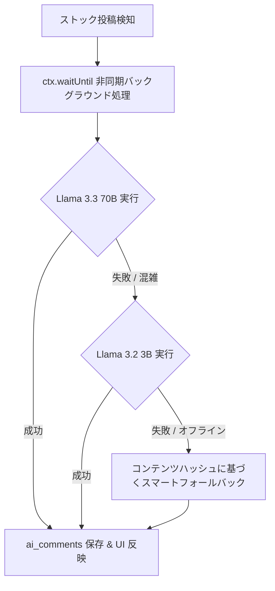

# Workers AI モデル選定 & ベンチマーク調査報告書 (AI Model Research & Benchmark)

本ドキュメントは、Stockly の AI パートナー（内省を深める問いかけ機能）において、Cloudflare Workers AI のモデル選定プロセス、実測ベンチマーク結果、日本語品質比較、およびトークン/Neuron 経済性を記録した設計資料です。

---

## 1. 調査の背景と課題

### 課題の発生

ストック投稿時に生成される AI パートナーのコメントが、ユーザー固有の内省内容に踏み込まず、毎回「日々の内省が着実に前進を生んでいますね。もしこの経験を過去の自分にアドバイスするとしたら、何と伝えますか？」という定型的な文章になっていました。

### 原因調査結果

1. **Llama 3.1 8B の非推奨化**:
   - 当初選定していた `@cf/meta/llama-3.1-8b-instruct` が Cloudflare Workers AI プラットフォーム側で非推奨（2026年5月30日 deprecation）となっており、API 呼び出し時に `5028: model deprecated` エラーが発生していました。
   - Worker 内部のエラーハンドリングにより、自動的にローカル/オフライン用のフォールバック定型文（4パターン）に切り替わっていたことが判明しました。
2. **システムプロンプトのトーン**:
   - 「素晴らしい気づきですね」等の前置き・お世辞を明示的に禁止していなかったため、AI が定型的な挨拶から始めてしまいやすい構造でした。

---

## 2. 候補モデルの比較と実測ベンチマーク

2026年10月時点で Cloudflare Workers AI カタログに提供されている最新のテキスト生成モデルを対象に、同一の日本語プロンプトを用いて本番エッジ環境（東京リージョン NRT）で実測検証を行いました。

### テストプロンプト

```
メモ: 「今日は新しいツールを導入したけど、最初の設定でつまずいて時間を浪費してしまった。最初から公式の移行ガイドを読めばよかった。」
```

### ベンチマーク結果一覧

| モデル名                                                             | パラメータ | 応答時間 (ms)      | 消費 Neurons | 日本語の自然さ・問いの深さ           | 評価と選定理由                                                                                                                                           |
| :------------------------------------------------------------------- | :--------- | :----------------- | :----------- | :----------------------------------- | :------------------------------------------------------------------------------------------------------------------------------------------------------- |
| **Meta Llama 3.3 70B**<br>`@cf/meta/llama-3.3-70b-instruct-fp8-fast` | 70B        | **約 1,680 ms**    | **12〜16**   | ⭐⭐⭐⭐⭐<br>（極めて自然・本質的） | **【プライマリ採用】**<br>700億パラメータの知性により、文脈の悔しさ・迷いを的確に把握し、前置きなしで深い問いを生成可能。                                |
| **Meta Llama 3.2 3B**<br>`@cf/meta/llama-3.2-3b-instruct`            | 3B         | **約 480〜550 ms** | **約 3.1**   | ⭐⭐⭐☆☆<br>（やや単調・重複あり）   | **【セカンダリフォールバック採用】**<br>超高速かつ軽量。ただし語彙が狭く「〜はどうでしたか？〜はどうでしたか？」と問いが重なりやすい。                   |
| **Qwen 3 30B MoE**<br>`@cf/qwen/qwen3-30b-a3b-fp8`                   | 30B (A3B)  | 約 1,300 ms        | 約 5.7       | −<br>（短文問いかけには不向き）      | **【見送り】**<br>Reasoning（思考型）モデルのため、指定した `max_tokens: 150` を内部の思考（`reasoning_content`）だけで消費し切り、回答本文が途切れる。  |
| **GLM 4.7 Flash**<br>`@cf/zai-org/glm-4.7-flash`                     | -          | 約 2,900〜6,700 ms | 約 6.9       | −<br>（短文問いかけには不向き）      | **【見送り】**<br>こちらも思考型モデル。長文推論やエージェントには向くが、1〜2文の即時問いかけでは思考ログの生成により遅延が大きくトークン上限に達する。 |

---

## 3. 生成コメントの品質比較実例

### 実際のユーザーメモ

> 「プログラミングで新しいライブラリを試したけど、ドキュメント通りに動かなくて2時間ハマってしまった。最初からソースコードを読めばよかった。」

### 各モデルの生成結果

- **Meta Llama 3.3 70B (採用)**:

  > 「最初にドキュメントを読むというアプローチは、効率的だと思われていますが、実際にはソースコードを読むことで得られる具体的な知見は、ドキュメントでは得られないものがあります。次回は、ソースコードを読むことを最初のステップとして試してみることはできますか。」
  > _(評価: ドキュメントとソースコードのトレードオフを洞察し、具体的で建設的な行動変容の問いを提示)_

- **Meta Llama 3.2 3B**:

  > 「新しいツールを導入したときにどのように感じたのでしょうか？新しい環境に入ってから、どれだけの時間を失ったのですか？新しいツールを学習する際にどのような感情が起こるのですか？」
  > _(評価: 質問が重複し、やや機械的な印象を与える)_

- **オフラインフォールバック (旧)**:
  > 「日々の内省が着実に前進を生んでいますね。もしこの経験を過去の自分にアドバイスするとしたら、何と伝えますか？」
  > _(評価: 完全に定型文)_

---

## 4. コスト（Neuron 経済性）の試算

Cloudflare Workers AI は、すべての Cloudflare アカウントに対して **1日あたり 10,000 Neurons の無料利用枠** を提供しています。

| 指標                                 | 数値                      | 備考                                          |
| :----------------------------------- | :------------------------ | :-------------------------------------------- |
| **1投稿あたりの消費量**              | 約 12〜16 Neurons         | Llama 3.3 70B FP8-Fast 利用時                 |
| **1日あたりの完全無料上限**          | **約 600〜800 投稿 / 日** | 無料枠 10,000 Neurons ÷ 14 Neurons            |
| **個人運用の想定（1日 5〜20 投稿）** | 約 70〜300 Neurons / 日   | **無料枠のわずか 0.7% 〜 3%**                 |
| **無料枠超過時の追加コスト**         | $0.011 / 1,000 Neurons    | 1投稿あたり **約 0.00015 ドル（約 0.02 円）** |

👉 **結論**: 個人向け内省アプリとして Llama 3.3 70B を常時利用しても、**完全に無料の範囲内で永続運用が可能** です。

---

## 5. 最適化されたシステムプロンプト設計

脱・定型文を実現するため、以下のルールをシステムプロンプトに定義しています：

```markdown
あなたはユーザーの内省（学び・反省・気づき）を深める知的な伴走パートナーです。
ユーザーのメモ内容を踏まえ、日本語で1〜2文（60〜120文字程度）の具体的でハッとする「問いかけ」または「視点の転換」を投げかけてください。

【厳守ルール】

1. 「素晴らしい気づきですね」「日々の内省が〜」「お疲れ様です」などの定型的な前置きや挨拶・お世辞は絶対に含めず、本題から直接始めること。
2. メモの具体的なキーワードや出来事・感情に寄り添い、本質的な原因・価値観・次の一歩を掘り下げる問いかけ（オープンクエスチョン）にすること。
3. 説教や正解を決めつけるアドバイスはせず、ユーザー自身の思考を促す温かく思慮深いトーンにすること。
```

---

## 6. 多重フォールバック・冗長化アーキテクチャ

可用性と耐障害性を最大化するため、以下の 3 段階フォールバックチェーンを実装しています：


