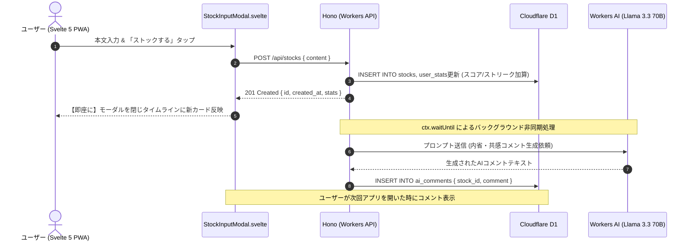
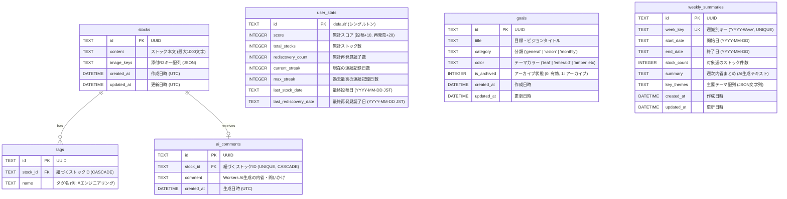

# 詳細設計書 (Detailed Design Specification)

本書は、**Svelte 5**、**Vite+ (`vp`)**、**Cloudflare エコシステム**、**Pulumi (IaC)** を採用した日々の内省・ストックアプリ「Stockly」の詳細設計書です。

---

## 1. 決定されたコア設計方針

| 項目                        | 決定事項                                                                             | 理由・UX方針                                                                                                              |
| --------------------------- | ------------------------------------------------------------------------------------ | ------------------------------------------------------------------------------------------------------------------------- |
| **フロントエンド**          | **Svelte 5 (Runes) + Tailwind CSS + Vite+**                                          | 仮想DOMなしによる**最速起動 & 超軽量バンドル**。React Hooksの依存関係・再レンダリング問題のない直感的なリアクティビティ。 |
| **利用形態 & 認証**         | **自分専用（シングルユーザー）**<br>Cloudflare Access / パスコード保護               | 個人用内省ツールとして素早く立ち上げるため。                                                                              |
| **リポジトリ構成**          | **pnpm Monorepo + Vite+ (`vp`)**<br>`apps/web` (Svelte 5 PWA) + `apps/api` (Workers) | Vite+ による高速リント・ビルドと、Workers API / Pulumi の責務分離を両立。                                                 |
| **AIコメント (Stockly-AI)** | **Cloudflare Workers AI (Llama 3.3 70B / 3.2 3B)**<br>※非同期バックグラウンド生成    | 投稿時は即座に保存・画面クローズし、記録の軽快さを最優先。コメントは裏側（`ctx.waitUntil`）で生成。                       |
| **再発見 (Rediscovery)**    | **1日1件固定（「今日の再発見」）**                                                   | 画面を開くたびに変わるのではなく、その日の振り返りテーマとしてじっくり内省を促す。                                        |
| **オフライン方針**          | **MVPはオンライン前提**                                                              | 通信エラー時はリトライ案内。複雑なオフライン同期は後続フェーズへ。                                                        |
| **画像添付 (R2)**           | **Milestone 3 で実装**                                                               | Milestone 1（MVP）はテキスト入力とコア体験の確立に集中。                                                                  |
| **ゲーミフィケーション**    | **標準仕様**（投稿+10pt、ストリーク+20pt）                                           | 毎日1回以上の投稿でストリーク継続。1日空くと1にリセット。                                                                 |

---

## 2. ディレクトリ構成 (Monorepo with Svelte 5)

```text
stockly/
├── .mise.toml                  # ツールバージョン固定 (Node.js LTS, pnpm, Pulumi)
├── pnpm-workspace.yaml         # モノレポ設定 (apps/*, infra)
├── package.json                # ルートスクリプト (vp check, vp test 等)
├── vite.config.ts              # ルート Vite+ 設定
├── apps/
│   ├── web/                    # フロントエンド PWA (Svelte 5)
│   │   ├── vite.config.ts      # Vite+ (Svelte 5 + Tailwind + vite-plugin-pwa)
│   │   ├── svelte.config.js    # Svelte 5 設定
│   │   ├── package.json
│   │   ├── src/
│   │   │   ├── components/     # Svelte コンポーネント (.svelte)
│   │   │   │   ├── BottomNav.svelte         # タブナビゲーション (ストック / ふりかえり)
│   │   │   │   ├── Header.svelte            # ブランドロゴ、ストリーク、キャッシュ更新
│   │   │   │   ├── StockCard.svelte         # ストック表示カード (AI問いかけアコーディオン)
│   │   │   │   ├── StockInputModal.svelte   # ストック入力・テンプレート・画像添付モーダル
│   │   │   │   ├── RediscoveryCard.svelte   # 今日の再発見 (1日1件固定・読了アクション)
│   │   │   │   ├── SearchBar.svelte         # 0ms 即時ローカル検索バー
│   │   │   │   ├── TagFilterBar.svelte      # 水平スクロールタグフィルター
│   │   │   │   ├── Timeline.svelte          # 日付別ストックタイムライン
│   │   │   │   └── StatsReport.svelte       # ふりかえりダッシュボード (目標, 週次AI, 通知, エクスポート)
│   │   │   ├── state/          # グローバル状態管理 (Svelte 5 Runes: .svelte.ts)
│   │   │   │   ├── stocks.svelte.ts         # ストック CRUD & キャッシュ
│   │   │   │   └── stats.svelte.ts          # ゲーミフィケーション統計
│   │   │   ├── lib/            # hono/client 型安全RPCクライアント & 通知
│   │   │   │   ├── api.ts
│   │   │   │   └── notifications.ts
│   │   │   ├── App.svelte      # メインレイアウト & 画面ルーティング
│   │   │   └── main.ts         # エントリポイント
│   │   └── public/             # PWA マニフェスト, アイコン, Favicon
│   └── api/                    # バックエンド API (Cloudflare Workers + Hono)
│       ├── wrangler.jsonc      # D1, Workers AI, R2, ASSETS バインディング定義
│       ├── package.json
│       ├── src/
│       │   ├── index.ts        # Hono アプリケーション
│       │   ├── routes/         # stocks (CRUD, tags, goals, rediscovery, export, summary)
│       │   ├── services/       # ai.ts (Workers AI Llama 3.3 70B), summary-ai.ts
│       │   ├── db/             # stocks.ts, stats.ts, goals.ts, ai-comments.ts, summary.ts
│       │   └── utils/          # streak.ts (JSTストリーク判定)
│       └── migrations/         # D1 マイグレーション SQL (0001〜0004)
├── infra/                      # Pulumi IaC
│   ├── Pulumi.yaml
│   ├── Pulumi.prod.yaml
│   ├── index.ts                # D1, R2 プロビジョニング
│   └── package.json
├── scripts/                    # 運用・検証スクリプト
│   ├── access-toggle.ts        # Cloudflare Access ON/OFF/STATUS 切替
│   └── import-csv.ts           # 過去データ一括インポートスクリプト
├── tests/                      # Playwright E2E テスト
│   └── e2e/
│       ├── local.spec.ts       # ローカル環境 CRUD フルサイクル自動テスト
│       └── prod.spec.ts        # 本番環境 Read-Only 表示・検索・耐久性自動テスト
└── docs/                       # ドキュメント (要件, 設計, マイルストーン, テスト戦略等)
```

---

## 3. End-to-End 型共有設計 (Zod + Hono RPC)

フロントエンド（Svelte 5）とバックエンド（Hono on Workers）間で、**コード生成なしで 100% 型安全な通信** を行うため、**Zod** と **Hono RPC (`hono/client`)** を採用します。

### 3.1 型共有のアーキテクチャ

```text
[バックエンド (apps/api)]
  1. Zod スキーマでリクエスト／レスポンスの構造を定義
  2. @hono/zod-validator を用いて API ルートを定義
  3. ルート定義の型 `AppType` を export
       │
       ▼ (pnpm workspace 経由で型のみ参照: import type { AppType } from 'api')
[フロントエンド (apps/web)]
  4. hc<AppType>('/') により型付き RPC クライアントを初期化
  5. URL・引数・戻り値がすべて自動で型補完 & コンパイル時検証される
```

### 3.2 具体的な実装例

#### バックエンド定義 (`apps/api/src/routes/stocks.ts` & `apps/api/src/index.ts`)

```typescript
import { Hono } from "hono";
import { zValidator } from "@hono/zod-validator";
import { z } from "zod";

// ① Zod スキーマ（入力バリデーション 兼 型定義）
export const createStockSchema = z.object({
  content: z.string().min(1, "本文を入力してください").max(1000),
  tagNames: z.array(z.string()).optional(),
});
export type CreateStockInput = z.infer<typeof createStockSchema>;

export const stockResponseSchema = z.object({
  id: z.string(),
  content: z.string(),
  created_at: z.string(),
  ai_comment: z.string().optional(),
});
export type StockResponse = z.infer<typeof stockResponseSchema>;

// ② Hono ルート定義
const app = new Hono().post("/api/stocks", zValidator("json", createStockSchema), async (c) => {
  const body = c.req.valid("json");
  // D1 保存処理 ...
  return c.json<StockResponse>(
    {
      id: "generated-id",
      content: body.content,
      created_at: new Date().toISOString(),
    },
    201,
  );
});

// ③ 型のエクスポート
export type AppType = typeof app;
```

#### フロントエンドでの呼び出し (`apps/web/src/lib/api.ts`)

```typescript
import { hc } from "hono/client";
import type { AppType } from "api";

// 完全型安全なクライアントインスタンス
export const api = hc<AppType>("/");
```

---

## 4. Svelte 5 状態管理設計 (Runes)

Svelte 5 では、従来のストア（`writable`）に代わり、TypeScript ファイル（`.svelte.ts`）内で **`$state`** や **`$derived`** を直接使ったモジュールレベルの状態管理を行います。

### 4.1 ストック状態管理例 (`apps/web/src/state/stockStore.svelte.ts`)

```typescript
import { api } from "../lib/api";

export interface Stock {
  id: string;
  content: string;
  created_at: string;
  ai_comment?: string;
}

export function createStockStore() {
  let stocks = $state<Stock[]>([]);
  let isLoading = $state(false);

  // 日付別にグループ化されたストック（派生状態）
  const groupedStocks = $derived.by(() => {
    const groups: Record<string, Stock[]> = {};
    for (const stock of stocks) {
      const dateKey = stock.created_at.slice(0, 10).replace(/-/g, "/");
      if (!groups[dateKey]) groups[dateKey] = [];
      groups[dateKey].push(stock);
    }
    return groups;
  });

  return {
    get stocks() {
      return stocks;
    },
    get groupedStocks() {
      return groupedStocks;
    },
    get isLoading() {
      return isLoading;
    },
    async loadStocks() {
      isLoading = true;
      try {
        const res = await api.stocks.$get();
        stocks = await res.json();
      } finally {
        isLoading = false;
      }
    },
    async addStock(content: string) {
      const res = await api.stocks.$post({ json: { content } });
      const newStock = await res.json();
      stocks = [newStock, ...stocks];
    },
  };
}
```

---

## 5. UI/UX 動作シーケンス



---

## 6. D1 データベース設計 & ER図 (確定版)

### 6.1 ER図 (Entity-Relationship Diagram)



### 6.2 D1 テーブル定義 & インデックス (全マイグレーション統合)

```sql
-- 1. ストック（日々の内省・記録）テーブル
CREATE TABLE IF NOT EXISTS stocks (
    id TEXT PRIMARY KEY,
    content TEXT NOT NULL,
    image_keys TEXT, -- JSON文字列 (Milestone 3画像添付)
    created_at DATETIME DEFAULT CURRENT_TIMESTAMP,
    updated_at DATETIME DEFAULT CURRENT_TIMESTAMP
);

-- 2. テーマ・タグ
CREATE TABLE IF NOT EXISTS tags (
    id TEXT PRIMARY KEY,
    stock_id TEXT NOT NULL,
    name TEXT NOT NULL,
    FOREIGN KEY (stock_id) REFERENCES stocks(id) ON DELETE CASCADE
);

-- 3. AIコメントテーブル
CREATE TABLE IF NOT EXISTS ai_comments (
    id TEXT PRIMARY KEY,
    stock_id TEXT NOT NULL UNIQUE,
    comment TEXT NOT NULL,
    created_at DATETIME DEFAULT CURRENT_TIMESTAMP,
    FOREIGN KEY (stock_id) REFERENCES stocks(id) ON DELETE CASCADE
);

-- 4. ユーザー統計（シングルユーザー用: id='default'）
CREATE TABLE IF NOT EXISTS user_stats (
    id TEXT PRIMARY KEY DEFAULT 'default',
    score INTEGER DEFAULT 0,
    total_stocks INTEGER DEFAULT 0,
    rediscovery_count INTEGER DEFAULT 0,
    current_streak INTEGER DEFAULT 0,
    max_streak INTEGER DEFAULT 0,
    last_stock_date TEXT, -- YYYY-MM-DD
    last_rediscovery_date TEXT -- YYYY-MM-DD (同日の重複加算防止)
);

-- 5. 目標・ビジョン管理テーブル
CREATE TABLE IF NOT EXISTS goals (
    id TEXT PRIMARY KEY,
    title TEXT NOT NULL,
    category TEXT NOT NULL DEFAULT 'general',
    color TEXT NOT NULL DEFAULT 'teal',
    is_archived INTEGER DEFAULT 0,
    created_at DATETIME DEFAULT CURRENT_TIMESTAMP,
    updated_at DATETIME DEFAULT CURRENT_TIMESTAMP
);

-- 6. 週次 AI サマリーレポートテーブル
CREATE TABLE IF NOT EXISTS weekly_summaries (
    id TEXT PRIMARY KEY,
    week_key TEXT NOT NULL UNIQUE,
    start_date TEXT NOT NULL,
    end_date TEXT NOT NULL,
    stock_count INTEGER NOT NULL,
    summary TEXT NOT NULL,
    key_themes TEXT, -- JSON文字列 (例: ["プログラミング", "内省習慣"])
    created_at DATETIME DEFAULT CURRENT_TIMESTAMP,
    updated_at DATETIME DEFAULT CURRENT_TIMESTAMP
);

-- インデックス
CREATE INDEX IF NOT EXISTS idx_stocks_created_at ON stocks(created_at DESC);
CREATE INDEX IF NOT EXISTS idx_tags_stock_id ON tags(stock_id);
CREATE INDEX IF NOT EXISTS idx_goals_created_at ON goals(created_at ASC);
CREATE INDEX IF NOT EXISTS idx_weekly_summaries_week_key ON weekly_summaries(week_key DESC);
```

### 6.3 テスト環境における D1 エミュレーション設計

単体・結合テスト（Vitest）において、本番 Cloudflare D1 と完全に同一の SQL 実行結果・制約挙動をミリ秒単位で高速再現するため、以下のテスティングアーキテクチャを採用しています：

- **エンジン**: Node.js LTS (v24.13.0+) 組み込みのネイティブ C++ SQLite 実装（`node:sqlite` の `DatabaseSync(':memory:')`）。
- **マイグレーション自動適用**: テスト用インスタンス初期化時に `apps/api/migrations/*.sql` を昇順で一括適用。
- **制約保証**: `PRAGMA foreign_keys = ON;` を有効化し、CASCADE 削除や親レコード存在チェックを本番同様に厳密検証。
- **D1Database インターフェース完全互換**: `prepare()`, `bind()`, `all()`, `first()`, `run()`, `batch()`, `raw()`, `exec()` を本物の SQLite ステートメントに透過的に委譲。
- **手動モック追随コストのゼロ化**: 旧来の手書きクエリ文字列判定（`query.includes`）を全廃したため、スキーマやクエリを変更してもテストヘルパーの修正が一切不要。
